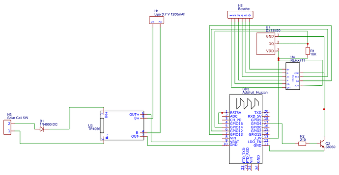

# Hive Monitor Software


* Measuring
	* The Weight
	* The Temperature (inside the Hive) 
	* The Battery Voltage
* Transmit the Measurement as JSON to an MQTT Server
* Support Update OTA Server (to upload new firmware updates)
* Deep Sleep (to enhance the battery lifetime)


## Firmware

### Dependencies

This Software is based on the [Homie for ESP8266](https://github.com/marvinroger/homie-esp8266) Framework.
Because this delivery the basic functionality to communicate with a mqtt server and brings it own (easy) setting.

The following libaries are required:

* HX711:              https://github.com/bogde/HX711
* RunningMedian:      https://github.com/RobTillaart/Arduino/tree/master/libraries/RunningMedian
* Homie-esp8266:      https://github.com/marvinroger/homie-esp8266
* Bounce2:            https://github.com/thomasfredericks/Bounce2
* ESPAsyncTCP:        https://github.com/me-no-dev/ESPAsyncTCP
* async-mqtt-client:  https://github.com/marvinroger/async-mqtt-client

### Setup

#### Build firmware
```bash
make build
```

#### Upload firmware
```bash
export PLATFORMIO_UPLOAD_PORT=/dev/ttyUSB0
make upload-firmware
```

#### Upload configuration
```bash
export PLATFORMIO_UPLOAD_PORT=/dev/ttyUSB0
make upload-config
```


# Hardware 
The following section will descriobe the hardware construction

## Buying List (for Electronic curcuit)
I Ordered the following parts from my local seller

* 1 x [Hx711](https://www.amazon.de/Verst%C3%A4rker-Gewichtssensoren-Anzeige-Modul-Digital-Konverter-Mikrocontroller/dp/B07MTYT95R/ref=asc_df_B07MTYT95R)
* 1 x Solarcell (for powering with the energy of the sun :))
* 1 x Lipo with 3.7 Voltage and 1200 mA 
* 1 x [H30A](https://www.bosche.eu/waagenkomponenten/waegezellen/plattform-waegezellen/plattform-waegezellen-h30a?gclid=Cj0KCQiAm4TyBRDgARIsAOU75sopW-AKahFClFZDqvMqvNG2f-zCtpa3S802P4ADE2INFBI6E7GvkkcaAq4JEALw_wcB) Weight cell (from Bosche)
* 1 x Wemos D1 mini Huzzah
* 1 x [DS18B20](https://www.sensorshop24.de/temperaturfuehler/luftfuehler/luftfuehler-bis-105-c/luftfuehler-bis-105-c-15df65d/a-96748/?ReferrerID=7&gclid=Cj0KCQiAm4TyBRDgARIsAOU75sqCkTF0dII80wNX8DOfFXFGCFUWQIpZqPubA2ZrfuUDXD-CR1SEdg4aAiVcEALw_wcB)
* 1 x [S8050](http://media.nkcelectronics.com/datasheet/s8050.pdf) as minimal switch curcuit.
* 1 x 210R
* 1 x  10K 
* 1 x TP4056


My shematic wiring looks like this:



## Wiring H30A to HX711
I wired the weightcell to the hx711 like this:

[Wiring](./h30A_hx711.png)


# Configuration 
The Configuration is done with an json file. An example of it looks like this:

```json
{
	"wifi":	{
		"ssid": "SSID",
		"password": "mysecret"
	},
	"mqtt":	{
		"host": "192.168.178.55",
		"port": 1886,
		"base_topic": "",
		"auth": true,
		"username": "username",
		"password": "password"
	},
	"name":"hive-teststand",
	"ota": {
		"enabled":false
	},
	"device_id":"hive-teststand",
	"settings": {
		"sleepTime": 3600,
    	"sendInterval": 320,
        "weightOffset": 244017.00,
        "kilogramDivider": 22.27
  	}
}
```
The following table will give you more insights about the settings.


|Setting|Description|
|-|-|
|wifi.sid|the wifis name.|
|wifi.password|The password for the wifi|
|mqtt.host|The host for the mqtt. This can be a dns name or a ip address.|
|mqtt.port|The Mqtt Port.|
|mqtt.base_topic|If there is a prefix required for a topic, then you can set here the basetopic.|
|mqtt.auth|__true__ when using authentication, or __false__ when not using it|
|mqtt.username|The username when authentication is configured.|
|mqtt.password|The password when authentication is configured.|
|name|This is the device name. This will shown up in the router later|
|ota.enabled|__true__ to enable _o_ver _t_he _a_ir update.|
|device_id|The device ID, possible the same as name.|
|settings.sleepTime|The Sleepingtime in seconds|
|settings.sendInterval|The intervall to send, the sleep time will be different. When you have a send intervall from 60 seconds and a weight intervall of 90 seconds it will take 2 rounds of wake up|
|settings.weightOffset|The weight offset. This is neccessary for the adjustment of the weightcell. Because there are some base weights.|
|settings.kilogramDivider|The divider to get the kilograms.|


# How to compile
First of all we must compile the complete project
```
	pio run
```

# Upload Firmare
After a successful compile, you will be able to upload the firmware by the given command. 

```
	pio run -t upload
```

This send the firmware directly to the default attached board.


# Configure the device Setting

## Sending preconfigured config (Recommended)
It will be easier for you t

>  pio run -t uploadfs


## Configure by the givin Homie interface

