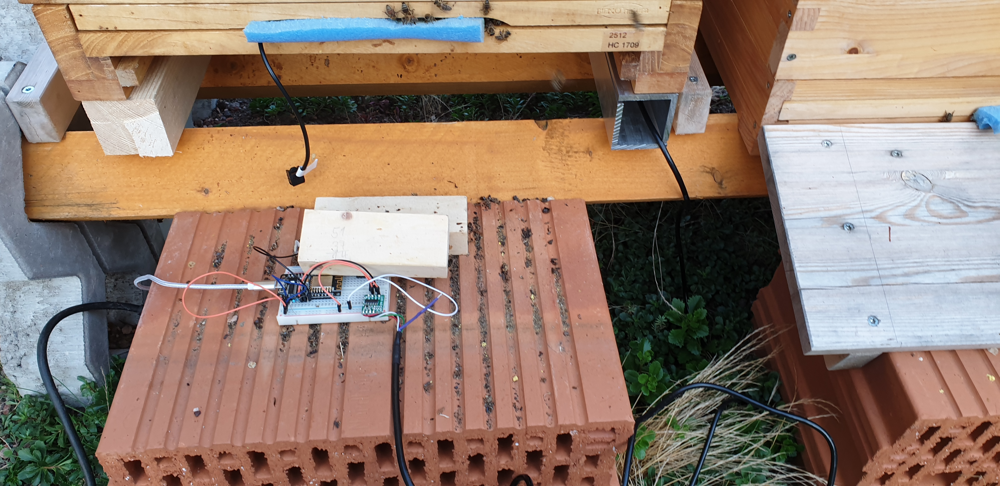

# Hive Monitor Software


## About
This project resembles a Hive Monitoring System for any ESP Hardware (with enough GPIO Ports).

The firmware has the following features:

* Measuring
    * The Weight
    * The Temperature (inside the Hive)
    * The Battery Voltage
* Transmit the measurements as JSON to an MQTT Server.
* Support Update OTA Server (to upload new firmware updates).
* Deep sleep (to enhance the battery lifetime).


## Firmware

### Dependencies

This Software is based on the [Homie for ESP8266](https://github.com/marvinroger/homie-esp8266) Framework.
Because this delivery the basic functionality to communicate with a mqtt server and brings it own (easy) setting.

The following libaries are required:

* HX711:              https://github.com/bogde/HX711
* RunningMedian:      https://github.com/RobTillaart/Arduino/tree/master/libraries/RunningMedian
* Homie-esp8266:      https://github.com/marvinroger/homie-esp8266
* Bounce2:            https://github.com/thomasfredericks/Bounce2
* ESPAsyncTCP:        https://github.com/me-no-dev/ESPAsyncTCP
* async-mqtt-client:  https://github.com/marvinroger/async-mqtt-client

### Setup

#### Build firmware
```bash
make build
```

#### Upload firmware
```bash
export PLATFORMIO_UPLOAD_PORT=/dev/ttyUSB0
make upload-firmware
```

#### Upload configuration
```bash
export PLATFORMIO_UPLOAD_PORT=/dev/ttyUSB0
make upload-config
```


## Hardware

A schematic overview:


Instead of a ESP DEV board, a [Wemos D1 mini](https://www.wemos.cc/en/latest/d1/) is used.

For now, the hardware has been tested on a breadboard. When the final design is finished,
a PCB will be created. Currently, the setup looks like this:


