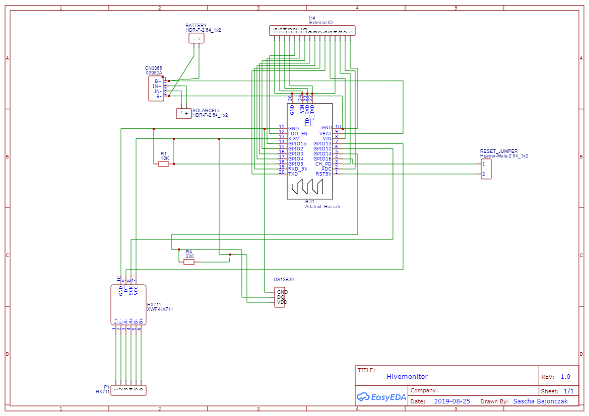

## :ledger: Index

- [About](#beginner-about)
- [Technologies](#zap-technologies)
  - [Configured Platforms](#configured_platforms)
  - [Development](#package-development)
  - [Pre-Requisites](#notebook-pre-Requisites)
  - [Branches](#cactus-branches)
- [Development Environment](#nut_and_bolt-development_environment)
  - [Build the Firmware](#hammer-build_the_firmware)
  - [Upload firmware](#rocket-upload_the__firmware)
  - [Upload the configuration](#page_facing_up-upload_the_configuration)  
- [Hardwaresetup](#electric_plug-hardwaresetup)
  - [Components List](#components_List)
  - [Wiring Schema](#wiring_schema)
  - [Wiring H30A to HX711](#wiring_h30a_to_hx711)
- [Configuration](#configuration)
  - [Upload_Configuration](#upload_configuration)
- [Planned Features](#planned_features)
# :beginner: About
This Software is build for Beekeepers, to collect some measurements and allows you to get some insights in your hive. 

With this you can automatically measure: 

* The Weight
* The Temperature (outside and inside the Hive) 
* The Battery Voltage

Also it transmits to any MQTT Server. By using the deep sleep mode, you will can use it nearly several weeks.
In addition with a solar cell, you are free to use without a powerplug!

You can Update your device by connecting it to your pc, or you use the OTA method.

# Technologies
This project will not work alone, so it has dependencies. 

## Configured Platforms
Actually it was Build and Testet on the following devices

* D1_Mini
* D1 Mini Huzzah
* ESP 8266 Devboard

## :package: Development


## :notebook:Pre-Requisites
This Software is based on the [Homie for ESP8266](https://github.com/marvinroger/homie-esp8266) Framework.

The following libaries are required:

* [HX711](https://github.com/bogde/HX711)
* [RunningMedian](https://github.com/RobTillaart/Arduino/tree/master/libraries/RunningMedian)    
* [Homie-esp8266](https://github.com/marvinroger/homie-esp8266)
* ArduinoJson@^5.13.4
* OneWire@^2.3.5
* DallasTemperature@^3.9.1
## :cactus: Branches
Here some description about the used branches

|Branch|Description|
|-|-|
|master|This contains the latest stable version|
|development|In this branch, I will put every development work for now. This branch is __NOT__ stable|


# :nut_and_bolt: Development Environment
First of all, the follwing commands required an installation of Platform IO. You can install it with the follwoing command: 

```bash
setup-virtualenv
```

## :hammer: Build the Firmware
You can Build your firmware very easyly with the following command:

```bash
make build-complete
```

## Environments

I created two environments. 

* esp12e/minimal
* esp12e/complete

The minimal enviroments reduce the image size.

This will be done by setting the compilerflags for the Homie Framework see [here](https://homieiot.github.io/homie-esp8266/docs/3.0.0/advanced-usage/compiler-flags/) for more info about this. 

## Using Compilerflags

I decided to use Compilerflags to configure the port mappings. So you will be able to modifie the used ports by modifying the flags instead in the source. 

|Flag|Description|Default|
|-|-|-|
|GPIO_HX711_DT|The DT Port for the HX711 device|13 (D7)|
|GPIO_HX711_SCK|The SCK Port for the HX711 device|12 (D6)|
|GPIO_ONEWIRE_BUS|This will be used for the onewire temperture sensors. It declares the data bus|14 (D5)|
|GPIO_MAINTENANCE_PIN|The Switch or Button, that tells the System that the hive must not operate. |15 (D8)|


## :rocket: Upload the firmware
After a successfull build you can upload it to your connected device with: 

```bash
make upload-firmware
```
In some cases you have multiple device connected. In this case, you must set the port to upload before with this command:

```bash
export PLATFORMIO_UPLOAD_PORT=/dev/ttyUSB0
```

This upload the firmware throught the /dev/ttyUSB0 port.

## :page_facing_up: Upload the configuration
```bash
export PLATFORMIO_UPLOAD_PORT=/dev/ttyUSB0
make upload-config
```

# :electric_plug:  Hardwaresetup 
The following section will describe the hardware construction

## Components List
I Ordered the following parts from my local seller

* 1 x [Hx711](https://www.amazon.de/Verst%C3%A4rker-Gewichtssensoren-Anzeige-Modul-Digital-Konverter-Mikrocontroller/dp/B07MTYT95R/ref=asc_df_B07MTYT95R)
* 1 x Solarcell (If you use the POWER of the sun :))
* 1 x Lipo with 3.7 Voltage and 1200 mA 
* 1 x [H30A](https://www.bosche.eu/waagenkomponenten/waegezellen/plattform-waegezellen/plattform-waegezellen-h30a?gclid=Cj0KCQiAm4TyBRDgARIsAOU75sopW-AKahFClFZDqvMqvNG2f-zCtpa3S802P4ADE2INFBI6E7GvkkcaAq4JEALw_wcB) Weight cell (from Bosche)
* 1 x Wemos D1 mini Huzzah
* 1 x [DS18B20](https://www.sensorshop24.de/temperaturfuehler/luftfuehler/luftfuehler-bis-105-c/luftfuehler-bis-105-c-15df65d/a-96748/?ReferrerID=7&gclid=Cj0KCQiAm4TyBRDgARIsAOU75sqCkTF0dII80wNX8DOfFXFGCFUWQIpZqPubA2ZrfuUDXD-CR1SEdg4aAiVcEALw_wcB)
* 1 x [S8050](http://media.nkcelectronics.com/datasheet/s8050.pdf) as minimal switch curcuit.
* 1 x 210R
* 1 x  10K 
* 1 x TP4056

## Wiring Schema
To wire it up, you can follow this schematic design



If you want, you can order a PCB by this design. 
You will find it [here](./Distribution/V1/Gerber_PCB_Hivemonitor_V1.zip)

## Wiring H30A to HX711

I was sometimes confused about the wiring of the loadcell to the HX711. So I decided to write down the wirings here to:

[Wiring](./h30A_hx711.png)

# Configuration 
The Configuration is done with an json file. An example of it looks like this:

```json
{
    "system": {
        "sleeptime": 2,
        "vccadjustsetting": 0
    },
    "scale": {
        "weightoffset": 0,
        "kilogramdivider": 0,
        "calibrationtemperaturesetting": 0,
        "calibrationfactorsetting": 0
    },
    "wifi": {
        "ssid": "",
        "password": "33"
    },
    "mqtt": {
        "server": "kjkhj",
        "port": 0,
        "user": "null",
        "password": "null"
    }

}

You can set and read the configuration when you use the maintenance mode.

```
The following table will give you more insights about the settings.

|Group|Setting|Description|
|-|-|-|
|system|sleeptime|The Sleepingtime in seconds|
|system|vccadjustsetting|This setting adjusting the battery monitor.|
|wireles|ssid|The wifi SSID.|
|wireles|password|The password to authenticate.|
|scale|weightoffset|This is the offset to Tare the 0 value. When no weight is placed.|
|scale|kilogramdivider|This is the Raw value, to divide the kilogram value out.|
|scale|calibrationtemperaturesetting|This is the measured temperatur when the intial adjust was done. This will later be used, to compensate the weight differences due to the temparture.|
|scale|calibrationfactorsetting|This will be the calibarion factor. Calculated ba the autotare function.|
|mqtt|server|The host for the mqtt. This can be a dns name or a ip address.|
|mqtt|port|The Mqtt Port.|
|mqtt|user|The username when authentication is configured.|
|mqtt|password|The password when authentication is configured.|


## Modify Configuration
When you activated the maintenance mode, you will be able to connect to the device. 
Since you have been connected, you can navigate to the device IP an it will show you the configuration Interface. 


## Upload Predefined Configuration
After you modified the configuration to your setting, you can upload this to your device.
```bash
 make upload-config
```

# Planned Features
I use this devices for my hives to. So I am not ready yet. 

For future Releases I planning to improve some thing and extend it with the following planned features:

* Support Lora
* Adding custom Webinterface to Configure the Device within the wireles connection
* ~~Adding Maintenance Mode
(Especcially when you work at the bees)~~ DONE


Feel free to suggest me more Features.

# FAQ

# My device does not start the AP mode
In this case you must erase the complete flash memmory of your device. 
You can do it in platform io with: 

```
pio run --target erase 
```